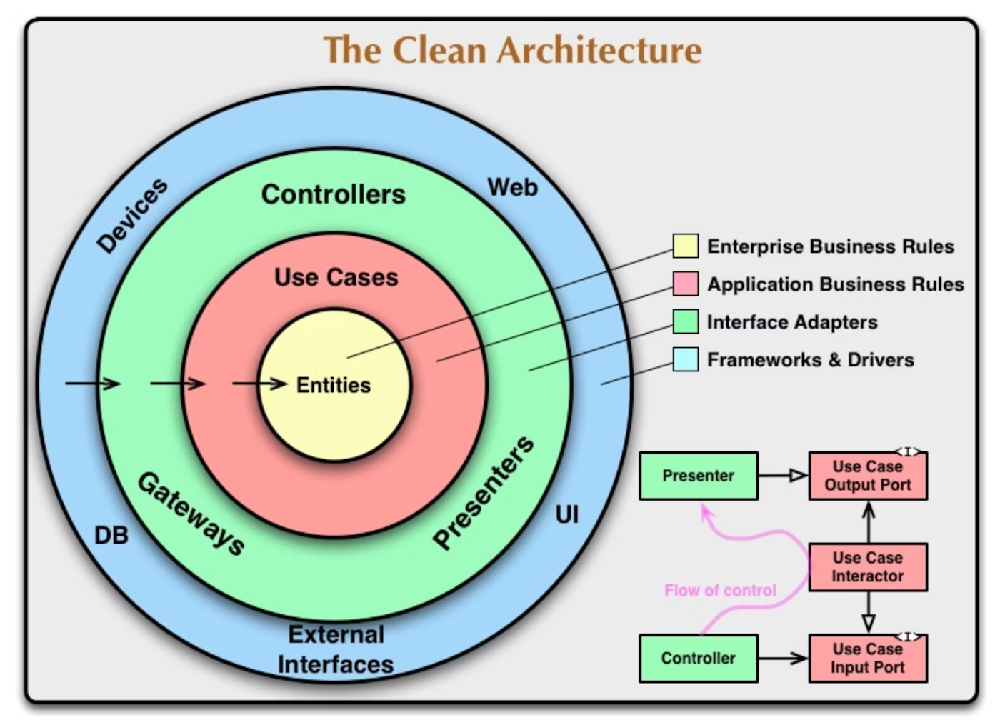

## Clean Architecture

This project follows the principles of Clean Architecture, 
ensuring that the core business logic is independent of external frameworks, databases, and other I/O components. 
The architecture promotes separation of concerns, making the system more maintainable and scalable.



---

## Directory Structure
```bash
.
├── domain
│   ├── model
│   └── repository
├── infra
│   ├── model
│   └── repository
├── injector
│   └── wire.go
├── interfaces
│   └── controller
└── usecase
    ├── dto
    │   ├── input
    │   └── output
    └── sample_interactor.go
```

---

## Layer Overview

### Entities (domain)
Located in the `domain` directory, the entities represent the core business objects and rules. 
This layer is independent of any other layers and frameworks.

- **Model**: Contains the business entities (e.g., message.go). 
- **Repository**: Contains abstract interfaces for data access (e.g., IMessageRepository).  
These interfaces are defined here to prevent the usecase layer from depending on the interface adapters.

> [!NOTE]
> Typically, `repository` is part of the interface adapters layer as `gateways`.  
> However, to avoid the `usecase` layer depending on the interface adapters, we define repository interfaces in the `domain` layer.

### Use Cases (usecase)

Located in the `usecase` directory, this layer contains the application-specific business rules.  
It orchestrates the flow of data to and from the entities and leverages the interfaces defined in the `domain` layer.

- **Interactor**: Contains the business logic that interacts with the entities.
- **DTO**: Data Transfer Objects used for input and output (e.g., input and output directories).

### Interface Adapters (interfaces)

Located in the api/interfaces directory,  
this layer converts data from the format most convenient for the use cases and entities to the format most convenient for external agents such as databases and the web.

- **Controllers**: Handle the HTTP requests and responses, interacting with the use cases.

### Frameworks & Drivers (infra)

Located in the `infra` directory, this layer contains the framework and driver code,  
such as database implementations, external APIs.

- **Model**: Contains database-specific models generated by `gorm/gen` (e.g., messages.gen.go).
- **Repository**: Implements the repository interfaces defined in the domain layer using specific frameworks (e.g., GORM for database operations).

### Dependency Injection (injector)

Located in the `injector` directory, this layer manages dependency injection configurations.

- **Wire**: Configures and initializes the dependencies using Google Wire (e.g., wire.go).