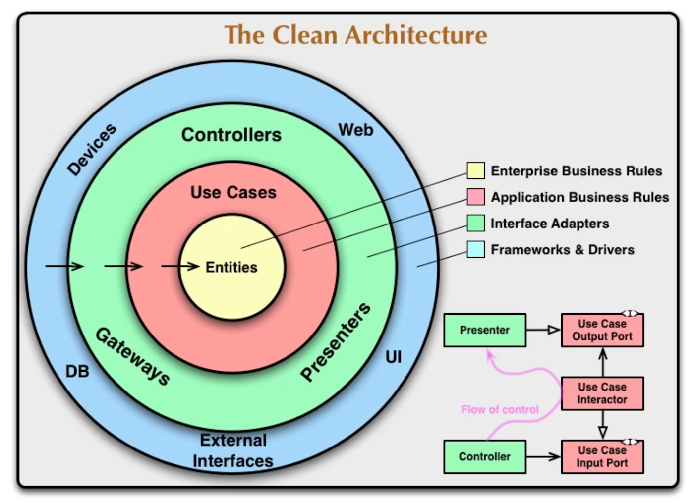

## Clean Architecture

This project follows the principles of Clean Architecture, 
ensuring that the core business logic is independent of external frameworks, databases, and other I/O components. 
The architecture promotes separation of concerns, making the system more maintainable and scalable.

<div align="center">
  
</div>

> Chapter 22, Figure 22.1: The clean architecture. This image instance was copied from Uncle Bob’s article [here](https://blog.cleancoder.com/uncle-bob/2012/08/13/the-clean-architecture.html).

## Directory Structure
```bash
├── domain
│   └── model # Entities
├── external # Frameworks & Drivers
│   ├── db # DB
│   └── server # Web
├── injector
│   └── wire.go
├── interfaces
│   ├── controller # Controllers
│   └── gateways # Gateways
│       └── repository # Data Access (Database Repositories)
└── usecase
    ├── dto # DTO (DataTransferObject)
    │   ├── input # Input Data<DS(Data Structure)>
    │   └── output # Output Data<DS>
    ├── repository # Data Access Interface<I(Interface)>
    └── interactor.go
    # Usecase Interactor:𝑈
    # InputBoundary:𝐼𝐵
    # OutputBoundary:𝑂𝐵
    # 𝑈 ∈ Impl(𝐼𝐵 ∪ 𝑂𝐵)
```

### Corresponding Class Diagrams

<div align="center">
  
</div>

> Chapter 22, Figure 22.2: A typical scenario for a web-based Java system utilizing a database

## Layer Overview

### Entities (domain)
Located in the `domain` directory, the entities represent the core business objects and rules. 
This layer is independent of any other layers and frameworks.

- **Model**: Contains the business entities (e.g., message.go).

#### Dependencies
- No dependencies

### Use Cases (usecase)

Located in the `usecase` directory, this layer contains the application-specific business rules.  
It orchestrates the flow of data to and from the entities and leverages the interfaces defined in the `domain` layer.

- **Interactor**: Contains the business logic that interacts with the entities.
- **DTO**: Data Transfer Objects used for input and output (e.g., input and output directories).
- **Repository**: Contains abstract interfaces for data access (e.g., IMessageRepository).

#### Dependencies
- domain
- usecase

### Interface Adapters (interfaces)

Located in the `interfaces` directory,  
this layer converts data from the format most convenient for the use cases and entities to the format most convenient for external agents such as databases and the web.

- **Controllers**: Handle the HTTP requests and responses, interacting with the use cases.
- **Gateways**
  - **Model**: Contains database-specific models generated by tools like SQLBoiler (e.g., messages.go). These models represent the structure of the data as it is stored in the database and are used by the repository implementations to interact with the database.
  - **Repository**: Implements the repository interfaces defined in the use cases layer using specific frameworks (e.g., SQLBoiler for database operations). The repository layer abstracts the data access logic and provides a clean API for the use cases to interact with the data source.

#### Dependencies
- domain
- usecase

### Frameworks & Drivers (external)

The Frameworks & Drivers layer, often referred to as the `external` layer, contains components and frameworks that interact directly with external systems and provide low-level implementations of interfaces defined in the Interface Adapters layer. 
This layer is responsible for interacting with external services, databases, and other systems that your application needs to function.

- **Web Frameworks**: Gin, which handle HTTP requests and responses.
- **Database Drivers:**: MySQL drivers, which enable interaction with relational databases.

#### Dependencies
- No dependencies

### Dependency Injection (injector) 

Located in the `injector` directory, this layer manages dependency injection configurations.  
This directory is unrelated to the clean architecture.

- **Wire**: Configures and initializes the dependencies using Google Wire (e.g., wire.go).
